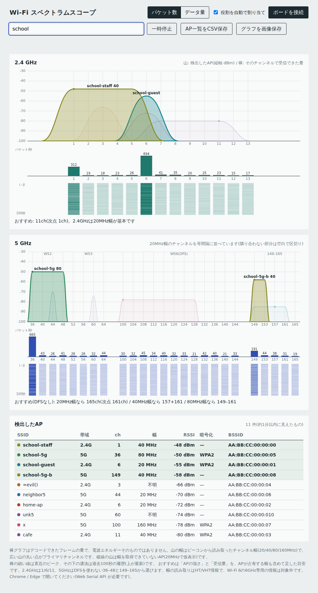
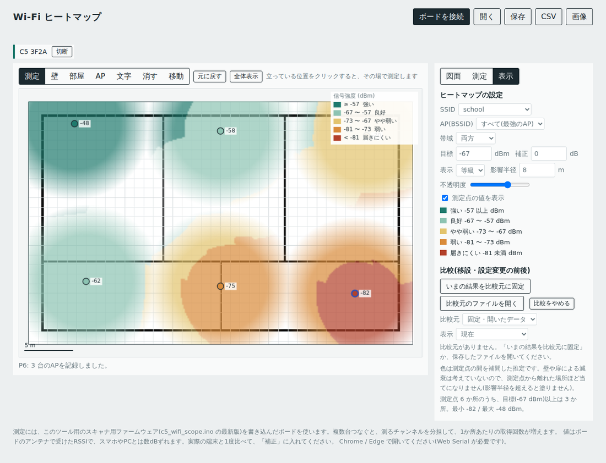
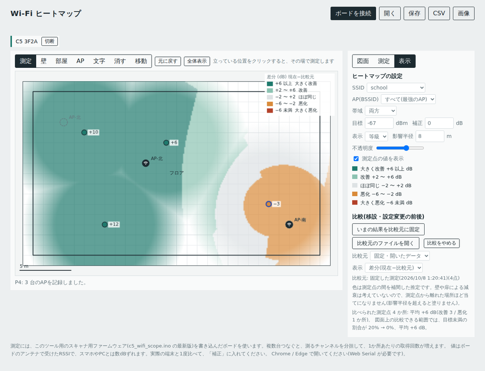

# C5 Wi-Fi スコープ

ESP32-C5(M5Stamp C5)を使って、Wi-Fi 環境を見える化する、2つのブラウザツールです。サーバーは要らず、ブラウザとボードをUSBでつなぐだけで動きます。

| ツール | できること |
|---|---|
| [チャンネル占有・AP一覧](web/scope.html) | 2.4GHz / 5GHz のAPを山の形で表示。チャンネルごとの混み具合、チャンネル幅(20/40/80/160MHz)、おすすめチャンネル、ピーク保持、履歴、CSV/画像保存 |
| [Wi-Fi ヒートマップ](web/heatmap.html) | 図面(画像を読み込む、または壁・部屋を描く)の上で、点ごとにRSSIを測って色分け。APの位置の記録、測り直しの履歴、移設前後の差分表示 |

> 画面は、ダミーのデータで描画したものです。





## 動作確認の状況(必ずお読みください)

作者が、**M5Stamp C5 1台で動作を確認しています**(2026年10月)。**ボードを複数台つないだ場合の動作は、実機では未確認です。** 下の表で「未確認」の項目は、確認できたらここに追記します。

| 項目 | 状況 |
|---|---|
| ビーコン解析(チャンネル幅の読み取り)の単体テスト | 確認済み(PC上、模擬ビーコン17パターン) |
| ブラウザ側(表示、測定の流れ、保存、比較) | 確認済み(模擬ボード) |
| ファームウェアのコンパイルと書き込み(M5StampC5 1台) | 確認済み(作者) |
| 実機での動作(M5StampC5 1台) | 確認済み(作者)。下の個別項目以外の機能は、確認の詳細を記録していません |
| 複数台をつないだときの動作(役割の自動割り当て、測定の分担) | **未確認**(ブラウザ側は模擬ボードで確認) |
| チャンネル幅の表示が、APの実際の設定と合うか | 確認済み(作者、M5Stamp C5 1台) |
| 役割表示のLED(G28)の点滅 | 確認済み(作者)。点灯と消灯が逆に見える場合は `LED_ON` を変更 |
| ヒートマップのRSSIの正確さ | 校正していません。値は目安です |

実機で試した方は、結果を Issue か README の更新で共有してもらえると助かります(対応は保証できません)。

## 必要なもの

- **動作確認したボード:** [M5StampC5(ESP32-C5)— スイッチサイエンス](https://www.switch-science.com/products/11347)(商品コード M5STACK-S016。ESP32-C5HF4、フラッシュ4MB)。他のESP32-C5ボードでは確認していません。
- パソコンの Chrome または Edge(Web Serial API が必要です。Safari と Firefox は非対応)
- Arduino IDE と、M5Stack のボードパッケージ(ESP32-C5 に対応した版)

## 使い方

### 1. ファームウェアを書き込む

1. [M5Stack 公式の Arduino クイックスタート](https://docs.m5stack.com/en/arduino/m5stampc5/program)に従い、ボードマネージャで M5Stack のボードパッケージを入れ、ボードに「M5StampC5」を選びます。
2. `firmware/c5_wifi_scope/c5_wifi_scope.ino` を開いて書き込みます。「USB CDC On Boot」の項目がある場合は Enabled にしてください。
3. ポートが表示されないときは、データ通信に対応したUSBケーブルか確認してください(M5Stack 公式の案内)。

### 2. ツールを開く

- **GitHub Pages などに置く場合:** `index.html` を開くと、2つのツールへのリンクがあります。Web Serial は HTTPS(または `localhost`、`file://`)で動きます。
- **手元で使う場合:** `web/scope.html` または `web/heatmap.html` を、Chrome / Edge にドラッグして開くだけです。

### 3. 使う

- **チャンネル占有・AP一覧:** 「ボードを接続」を押してポートを選びます。ボードは複数台つなげます。台数に応じて、2.4GHz担当・5GHz担当・AP検出専用に自動で役割を分けます。
- **ヒートマップ:** 「ボードを接続」→「測定」タブの「APを探す」→ 測るSSIDにチェック → 図面の自分の位置をクリックすると、その場で測定します。複数台つなぐと、測るチャンネルを分担します。

## 仕組みと限界

- **本物のスペクトラムアナライザではありません。** 受信できたWi-Fiのフレーム(ビーコンとフレーム数・サイズ・RSSI)から、チャンネルの混み具合とAPの強さを見ています。Wi-Fi以外の電波(電子レンジなど)は見えません。
- チャンネル幅は、ビーコンの HT / VHT Operation から読んでいます。ビーコンを聞き取れたAPだけです。6GHz(Wi-Fi 6E)には対応していません。
- ヒートマップは、測定点の間を補間した推定です。壁やドアでの減衰は計算していません。測定点から遠い場所(影響半径の外)は塗りません。
- ヒートマップの値は、**校正していない目安**です。ボードのアンテナで受けたRSSIなので、スマホやPCとは数dBずれることがあります。弱い場所を見つける用途を想定しています。必要なら画面の「補正」で調整できます。
- RSSIは電波の強さだけで、通信の速さや安定性は分かりません。

## プライバシーと使い方の注意

- このツールが扱うのは、ビーコン(APが公開している情報)と、フレームの数・大きさ・RSSIだけです。通信の中身(データ部分)は取得も保存もしません。
- 測定データや図面は、使っている人のブラウザの中だけで扱い、外部には送りません。保存したJSON/CSVには、SSIDや図面が入るので、公開しないよう注意してください(`.gitignore` で、既定のファイル名は除外しています)。
- 自分の管理する環境、または管理者の許可を得た環境で使ってください。

## ファイルの構成

```
index.html                         2つのツールへのリンク(GitHub Pages 用)
web/scope.html                     チャンネル占有・AP一覧
web/heatmap.html                   ヒートマップ
firmware/c5_wifi_scope/            ボード用ファームウェア(Arduino)
docs/protocol.md                   ボードとブラウザのシリアル通信の仕様
```

## サポートについて

配布のみで、継続的なサポートは行いません。MIT ライセンスです。自由に改変・再配布してください。M5Stack 社とは関係ありません。

## 参考

- [M5StampC5(ESP32-C5)— スイッチサイエンス](https://www.switch-science.com/products/11347)(仕様の確認に使用)
- [M5Stack: Stamp-C5 Arduino Program Compilation & Upload](https://docs.m5stack.com/en/arduino/m5stampc5/program)(ボードの選び方)

## ライセンス

[MIT](LICENSE)

---

## English (short)

Two browser-only tools for visualizing Wi-Fi on an ESP32-C5 board (e.g. M5Stamp C5), connected over Web Serial (Chrome/Edge): an AP / channel-occupancy viewer (with channel width read from beacons) and a point-by-point Wi-Fi heatmap on an uploaded or hand-drawn floor plan, with before/after comparison. It is **not** an RF spectrum analyzer; it works from received Wi-Fi frames (beacons, frame counts, RSSI). **Tested by the author on a single M5Stamp C5**; multi-board behavior has only been tested against a simulated board. Provided as-is under the MIT license, without support.
